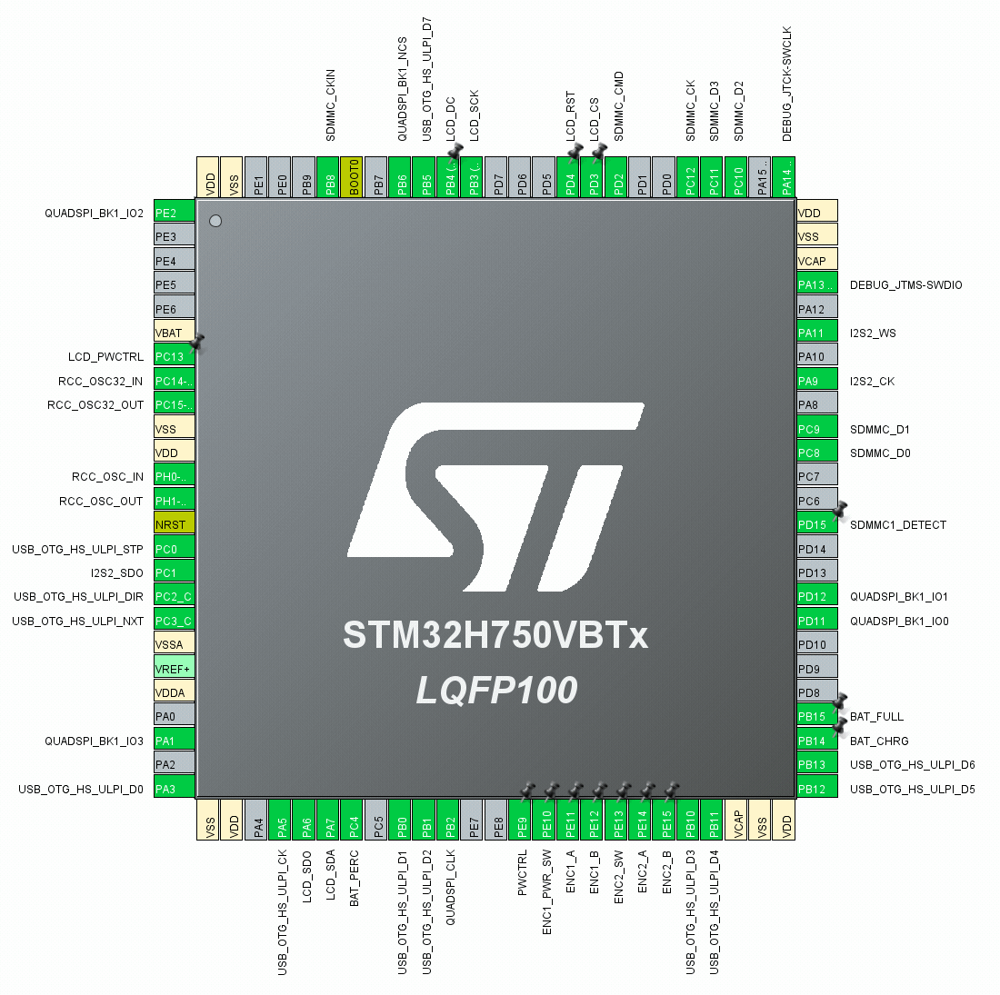

# Miniature TV

This solution implements a compact media player using the STM32H750 microcontroller as the core processor. It reads AVI-format media files from a TF card, decodes the embedded MJPEG video stream, and outputs the content in real time. Video playback is delivered on a 320x240 ILI9341 LCD driven via a high-speed 50 Mbps SPI interface. Simultaneously, audio playback is handled through the I2S interface, ensuring synchronized audiovisual output.

## Key Features

* Core Processor: STM32H750 for efficient real-time decoding and system control.
* Video Playback: Drives ILI9341 TFT LCD at 50 Mbps over SPI for fluid video display.
* Audio Playback: Uses I2S interface for high-fidelity digital audio output.
* Storage & File Support: Reads standard AVI files (with MJPEG video) from TF card.
* User Interface: Navigable via EC11 encoder; its button serves as the primary OK/power-on control.
* USB Functionality: Implements high-speed USB mass storage class via USB3300-EZK PHY, enabling file transfer as a card reader.
* Audio Amplification: Utilizes the MAX98357AETE+T I2S amplifier for direct audio output.

## Pin Connection

* User input is handled through EC11 rotary encoders, with the button on encoder 1 functioning as the primary selection (OK) and power-on control.
* USB High-Speed (using USB3300-EZK as PHY) is configured in mass storage mode, allowing the device to act as a card reader when connected to a host computer.
* Audio output is managed by the MAX98357AETE+T I2S amplifier chip.

## QSPI FLASH

* The QSPI FLASH stores GUI multimedia assets, such as fonts and icons. To generate the asset image file, navigate to the `FlashROM` folder and run `make -j` using your `arm-none-eabi-gcc` toolchain. This produces the ROM image file `FlashROM.bin`.
* Attach your `w25q64jv` NOR FLASH chip to a CH341 programmer and use NeoProgrammer software to program the ROM image. Once programmed, solder the chip onto your board.
